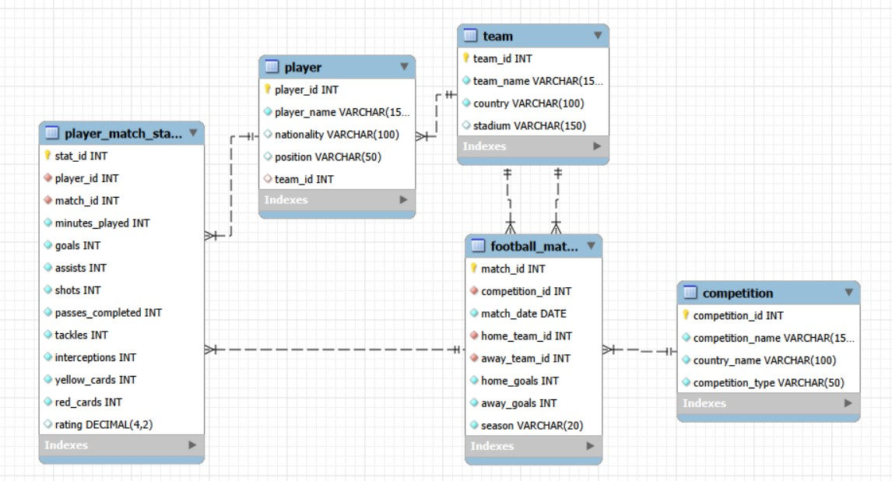

# Proyecto de analisis de futbol con SQL

## Descripcion

Este proyecto organiza y analiza datos abiertos de futbol procedentes de StatsBomb. El objetivo es construir una base de datos relacional que permita estudiar partidos, equipos, competiciones y rendimiento individual de jugadores mediante consultas SQL reproducibles.

El modelo sigue un enfoque cercano a un esquema en estrella. `player_match_stats` actua como tabla de hechos, con una fila por jugador y partido, mientras que `player`, `football_match`, `team` y `competition` aportan el contexto necesario para interpretar cada registro.

## Estructura del proyecto

- `01_schema.sql`: crea la base de datos, las tablas, restricciones, claves, indice y vista de negocio.
- `02_data.sql`: documenta el orden de importacion de los CSV y realiza comprobaciones posteriores a la carga.
- `03_eda.sql`: contiene diez consultas de analisis exploratorio, sin operaciones de limpieza ni creacion de objetos.
- `data_clean/`: contiene los CSV preparados para su importacion.
- `transform_statsbomb_to_csv.py`: transforma los archivos JSON originales en las cinco tablas CSV utilizadas por el proyecto.
- `model.jpg`: representa el modelo relacional.

## Datos utilizados

Los datos se han obtenido de StatsBomb Open Data y se han transformado a un formato tabular adaptado al modelo SQL. El conjunto preparado contiene:

| Archivo | Registros |
|---|---:|
| `team.csv` | 354 |
| `competition.csv` | 24 |
| `football_match.csv` | 3.961 |
| `player.csv` | 11.794 |
| `player_match_stats.csv` | 152.133 |

Los partidos abarcan desde el 24 de junio de 1958 hasta el 27 de julio de 2025. Debido a que se trata de datos abiertos, la cobertura no es uniforme para todas las competiciones y temporadas. Por este motivo, las comparaciones deben interpretarse teniendo en cuenta el numero de partidos disponible.

## Modelo de datos

La granularidad de `player_match_stats` es una actuacion de un jugador en un partido. Esta decision permite agregar el rendimiento por jugador, posicion, equipo, competicion o temporada sin duplicar las metricas.

Relaciones principales:

- Un equipo puede aparecer como local o visitante en muchos partidos.
- Una competicion contiene muchos partidos.
- Un jugador puede estar asociado a un equipo.
- Un jugador y un partido se relacionan mediante `player_match_stats`.
- La combinacion de jugador y partido es unica en la tabla de hechos.

El esquema incorpora claves primarias y foraneas, restricciones de rango y una restriccion unica sobre `player_id` y `match_id`. Tambien incluye el indice `idx_player_match_stats_player_match`, util para consultas que buscan o agregan actuaciones por jugador y partido.

La vista `vw_player_performance_summary` resume partidos, minutos, goles, asistencias y rating medio por jugador. En `03_eda.sql` se reutiliza para comparar la produccion ofensiva y detectar jugadores situados por encima del rating medio global.

## Ejecucion

El proyecto esta preparado para MySQL 8.0 o superior, ya que utiliza CTE, funciones ventana y restricciones `CHECK`.

1. Ejecutar `01_schema.sql`.
2. Importar los CSV de `data_clean/` respetando este orden:
   `team`, `competition`, `football_match`, `player` y `player_match_stats`.
3. Ejecutar `02_data.sql` para completar y comprobar la carga.
4. Ejecutar `03_eda.sql` para obtener los resultados analiticos.

La importacion puede realizarse desde MySQL Workbench o DBeaver. Los nombres de las columnas de cada CSV coinciden con los nombres definidos en las tablas.

## Analisis exploratorio

Las diez consultas de `03_eda.sql` responden a las siguientes preguntas:

1. Que competiciones y temporadas presentan un promedio goleador mas alto.
2. En que competiciones existe una mayor ventaja para el equipo local.
3. Cuales son los cinco primeros equipos de cada competicion y temporada segun sus resultados.
4. Que jugadores producen mas goles y asistencias por cada 90 minutos.
5. Que jugadores superan el rating medio global.
6. Quienes lideran el rendimiento dentro de cada posicion.
7. Que acciones caracterizan el juego de cada posicion.
8. En que competiciones y posiciones se registran mas tarjetas.
9. Que nacionalidades acumulan mayor representacion y volumen de minutos.
10. Como evoluciona mensualmente el promedio de goles de cada competicion.

Estas consultas incluyen agregaciones, conversion de tipos, funciones de fecha, subqueries, `INNER JOIN`, `LEFT JOIN`, logica condicional con `CASE`, CTE encadenadas y funciones ventana con `PARTITION BY`.

## Decisiones de analisis

Para comparar jugadores se establecen minimos de partidos o minutos. De esta forma se evita situar en las primeras posiciones a futbolistas con una muestra demasiado pequena. En los rankings de equipo, cada partido se transforma en una fila para el local y otra para el visitante antes de calcular puntos, diferencia de goles y posicion.

El vinculo entre un jugador y su equipo representa la asociacion disponible en el conjunto transformado. Por tanto, no debe interpretarse necesariamente como un historial completo de traspasos. Del mismo modo, un rating resume el rendimiento registrado en la fuente, pero no sustituye el analisis detallado de las acciones realizadas durante el partido.

## Tecnicas SQL aplicadas

- Agregaciones mediante `COUNT`, `SUM` y `AVG`.
- Conversiones con `CAST`.
- Funciones de fecha como `YEAR` y `DATE_FORMAT`.
- Logica condicional mediante `CASE`.
- Subqueries para comparar jugadores con la media global.
- Uniones `INNER JOIN` y `LEFT JOIN`.
- CTE simples y encadenadas.
- Rankings y medias moviles mediante funciones ventana.
- Reutilizacion de una vista de negocio y del indice compuesto del modelo.

## Limitaciones

El conjunto no contiene todos los partidos disputados por cada competicion y temporada. Las clasificaciones calculadas reflejan exclusivamente los encuentros disponibles en la base de datos y no siempre coinciden con las clasificaciones oficiales completas. Ademas, las estadisticas individuales dependen de la disponibilidad de eventos y alineaciones en la fuente original.

## Autor

Proyecto academico realizado como practica de modelado relacional y analisis exploratorio con SQL.
